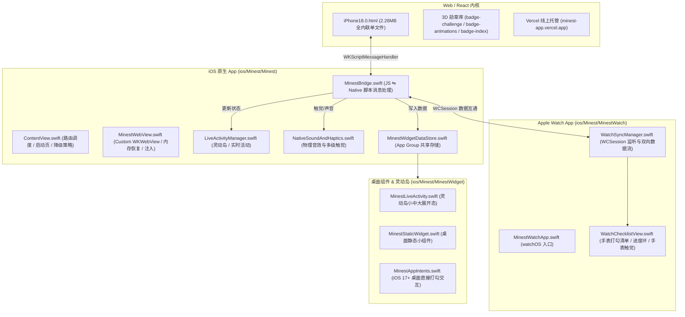

# Minest iOS App & Apple Watch App 工作交接说明文档 (Handover Guide)

> **版本基准**：`iPhone 18.0 正式版`  
> **Git 锚点标签**：`iphone18.0` / `iphone18.0-official`  
> **专属发布分支**：`release/iphone-18.0`（HEAD 与 `main` 对齐）  
> **线上部署服务**：[https://minest-app.vercel.app/iphone](https://minest-app.vercel.app/iphone)  
> **生成时间**：2026-10-01  

---

## 一、 项目背景与多端架构全景

Minest 是一款将 **“卡片学习流”** 与 **“Apple 拟物感活动三圈 & 3D 电子勋章体系”** 深度融合的高效生产力应用。项目采用了 **“SwiftUI 原生宿主 + 极致调优的 Local WKWebView 渲染内核 + Apple Watch 实时互联 + ActivityKit 灵动岛”** 的混合多端架构。



---

## 二、 核心代码目录与模块说明

```
minest/
├── iPhone18.0.html               # Web/iOS 端基准页面 (React 18 全量内联应用)
├── iphone.html                   # 根目录镜像（Vercel 与本地静态默认入口）
├── vercel.json                   # 路由重写规则 (/iphone, /iphone18.0 -> /iPhone18.0.html)
├── badge-animations/             # 勋章三环动效、六边机械揭秘、破茧动画 WebGL 库
├── badge-challenge/              # 勋章墙 (Badge Wall)、收集展台 (Collection)
├── badge-index/                  # 勋章索引 (Index Preview) 3D 模型检查器
│
└── ios/Minest/                   # Xcode 工程根目录 (Minest.xcodeproj)
    ├── Minest/                   # iOS 主工程
    │   ├── MinestApp.swift       # iOS App 启动入口 (@main)
    │   ├── ContentView.swift     # 主视图：优先加载本地 iphone18.0.html，失败回退线上
    │   ├── MinestWebView.swift   # 自定义 WKWebView：注入原生能力、防手势缩放、安全区适配
    │   ├── MinestBridge.swift    # 原生桥梁：处理触觉、声音、灵动岛更新、卡片动作
    │   ├── iPhoneWatchSyncManager.swift # 手机端 WatchConnectivity 管理器
    │   ├── NativeSoundAndHaptics.swift  # 物理级震动引擎与音效合成
    │   ├── LiveActivityManager.swift    # ActivityKit 灵动岛会话管理
    │   ├── StudyActivityAttributes.swift# 灵动岛数据模型声明
    │   ├── MinestWidgetDataStore.swift  # 桌面小组件与灵动岛数据持久化
    │   ├── NativeMotionService.swift    # 陀螺仪 / 加速度计硬件物理数据流 (3D 勋章倾斜)
    │   ├── iphone18.0.html       # 随 App 打包的离线 Bundle 资源
    │   └── iphone.html           # 备选 Bundle 资源
    │
    ├── MinestWatch/              # Apple Watch 原生工程
    │   ├── MinestWatchApp.swift  # watchOS 启动入口 (@main)
    │   ├── WatchSyncManager.swift# 手表端 WCSession：监听手机发来的任务清单与三环
    │   └── WatchChecklistView.swift # 手表原生 SwiftUI 界面：任务勾选、完成动效
    │
    └── MinestWidget/             # 桌面小组件与灵动岛扩展
        ├── MinestLiveActivity.swift # 灵动岛锁屏展开态、紧凑态、极小态布局
        ├── MinestStaticWidget.swift # 桌面卡片清单小组件
        └── MinestAppIntents.swift   # 交互式小组件 Intent（免打开 App 直接打勾）
```

---

## 三、 JS ⇋ Native 核心通讯协议规范

### 1. Web ➜ 原生通信 (`window.MinestNative.send`)

在 `MinestWebView.swift` 中，原生容器向 JS 环境注入全局对象 `window.MinestNative`。网页内所有的原生调用均通过 `window.webkit.messageHandlers.minestBridge.postMessage` 派发：

| Action 指令 | 参数 Payload 示例 | 原生处理行为 |
| :--- | :--- | :--- |
| `triggerHaptic` | `{ style: 'light' \| 'medium' \| 'heavy' \| 'success' \| 'error', sound: true }` | 调用 `NativeSoundAndHaptics` 触发 Taptic Engine 物理震动与点按音效 |
| `updateChecklist` | `{ title: 'Math', completed: 3, total: 5, isAllDone: false }` | 实时刷新 ActivityKit 灵动岛数字、更新 Apple Watch 与桌面小组件清单 |
| `updateActivityRings` | `{ focusMinutes: 45, checkCount: 12, goalPercent: 100 }` | 将最新三环进度广播至 Apple Watch 并存入本地 `UserDefaults` |
| `cardAction` | `{ subAction: 'create' \| 'complete', cardId: '...', ... }` | 触发原生卡片归档与 Spotlight 搜索索引更新 |
| `startStudySession` | `{ durationMinutes: 25, title: 'Deep Focus' }` | 启动灵动岛实时计时活动（Countdown Live Activity） |
| `endStudySession` | `{}` | 立即结束并关闭灵动岛实时活动 |

### 2. 原生 ➜ Web 通信

原生宿主通过 `WKWebView.evaluateJavaScript` 或向窗口分发自定义事件通知前端：

* **手表三环回传**：`window.dispatchEvent(new CustomEvent('minestActivityRingsUpdated', { detail: rings }))`
* **外部快捷指令/分享同步**：`window.dispatchEvent(new CustomEvent('minestCardCreated', { detail: card }))`
* **环境标示注入**：
  ```javascript
  window.__isMinestNative = true;
  window.__isFocusboardNative = true;
  window.__minestAppVersion = '18.0';
  ```

---

## 四、 核心历史深坑与关键设计决策（务必注意！）

接手此项目时，以下几个“踩坑点”已有针对性解决方案，后续开发请**严格遵循**现有方案，避免重蹈覆辙：

### 1. `file://` 沙盒下的 WebGL 与 CORS 拦截问题
* **痛点**：在 iOS 本地 Bundle 或直接以 `file://` 打开 HTML 时，WebKit 沙盒会拦截带有 `crossorigin` 的子 iframe 样式与 3D 着色器请求，导致勋章呈现白底破损或黑屏。
* **现行方案**：
  在 `iPhone18.0.html` 中内置智能协议探测：
  ```javascript
  var isLocalFile = window.location.protocol === 'file:' || 
                    window.location.protocol === 'blob:' || 
                    !window.location.protocol;
  var badgeBaseUrl = isLocalFile ? 'https://minest-app.vercel.app' : '.';
  ```
  本地沙盒自动以线上 CDN 绝对路径加载资源，线上环境使用相对路径；且子 iframe 的 postMessage 统一放行为 `'*'`，彻底规避跨域拦截。

### 2. 三环动效与勋章馆（Awards Wall）的解耦
* **痛点**：此前在每日目标完成后打开顶栏 `⭕️`，会被强制锁死在全屏庆祝动画中无法返回。
* **现行方案**：
  - 点击顶栏 `⭕️` 按钮**默认只打开勋章馆**（`ActivityBadgesModal`），展示 3D 勋章与收集网格。
  - 达成三环全闭环时，仅在面板提供可选的 `▶ 播放庆祝` 按钮。
  - 庆祝动效界面配有右上角毛玻璃 `✕ 退出动画` 按钮、底部 `前往勋章馆 →` 按钮、ESC 键支持以及 7.5 秒安全超时，绝不会锁死界面。

### 3. Xcode 16+ 文件同步机制
* 本项目采用 Xcode 16 的 `PBXFileSystemSynchronizedRootGroup` 机制。**直接将 HTML 文件拷贝到 `ios/Minest/Minest/` 目录即可自动成为 Bundle 资源**，无需手动修改脆弱的 `.pbxproj` 字符串。

### 4. WKWebView 内存防崩重载机制
* 3D WebGL 模型与大量动画长期运行可能触发 iOS 系统的 WebContent 进程强杀（Jetsam 机制）。在 `MinestWebView.swift` 中实现了 `webViewWebContentProcessDidTerminate`，发生内存崩溃时会自动无感平滑重载。

---

## 五、 本地开发与构建运维指南

### 1. 编译与调试 iOS 原生 App

```bash
cd ios/Minest

# 1. 在 iOS 模拟器上进行验证构建
xcodebuild -scheme Minest -destination 'generic/platform=iOS Simulator' build -quiet

# 2. 如果连接了真实 iPhone，选择真机进行构建或在 Xcode 中打开工程
open Minest.xcodeproj
```

### 2. 发布同步工作流（一处修改，双端同步）

当在 `iPhone18.0.html` 完成了前端代码修改后，务必执行以下同步命令：

```bash
# 1. 同步覆盖各端入口文件
cp iPhone18.0.html iphone.html
cp iPhone18.0.html ios/Minest/Minest/iphone18.0.html
cp iPhone18.0.html ios/Minest/Minest/iphone.html

# 2. 提交并推送到 GitHub 触发 Vercel 线上自动化部署
git add .
git commit -m "feat/fix: <你的描述>"
git push origin main

# 3. 验证 Vercel 部署状态
curl -sI https://minest-app.vercel.app/iphone | head -n 5
```

### 3. 恢复至当前基准版本（iPhone 18.0 正式版）

如果后续重构出现异常，可通过以下命令随时无损回到当前稳定锚点：

```bash
git checkout iphone18.0-official
```

---

## 六、 交接任务建议清单

1. **Watch 端增强**：目前 Apple Watch 端清单已打通，后续可基于现有 `WatchSyncManager.swift` 进一步优化 Complication（表盘复杂功能图元刷新）。
2. **离线 3D 资源彻底本地化**：当前本地沙盒下勋章 3D 模型回退至 Vercel CDN。若需实现“完全无网离线 3D 渲染”，可编写预编译脚本将 GLB/Texture 资源内联为 Base64 或放入 iOS 原生 Local HTTP Server 容器。
3. **App Store 提审配置**：确保 `Minest.entitlements` 中的 App Groups 与 iCloud Key-Value 存储在开发者中心完成 Provisioning Profile 匹配。
